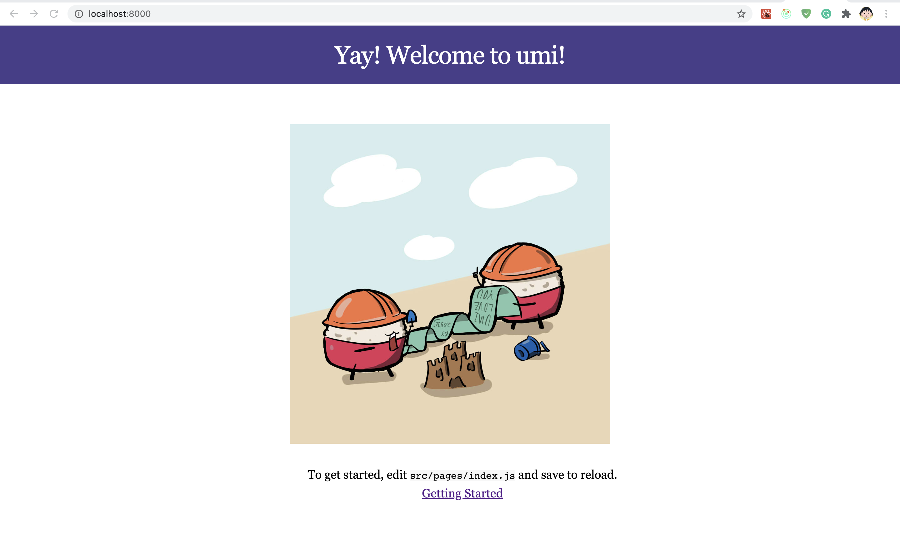
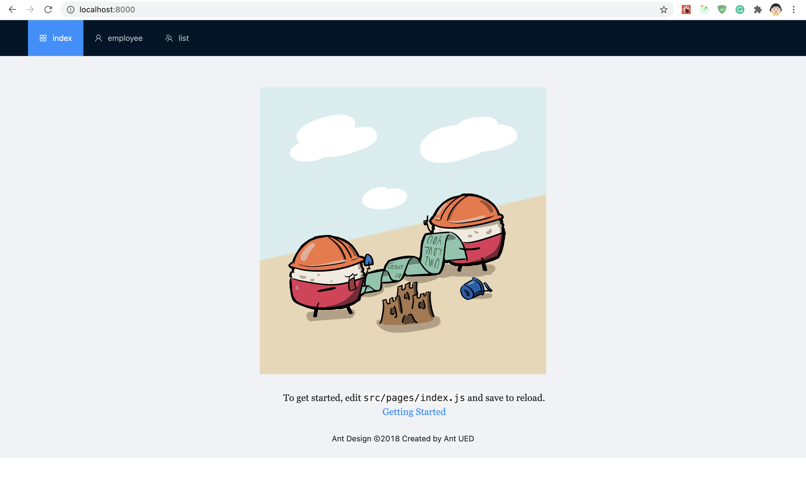
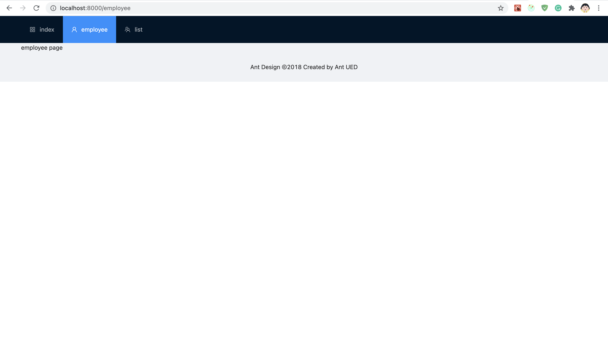
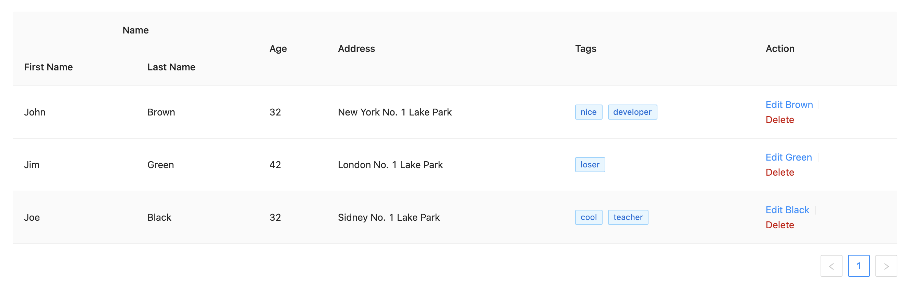
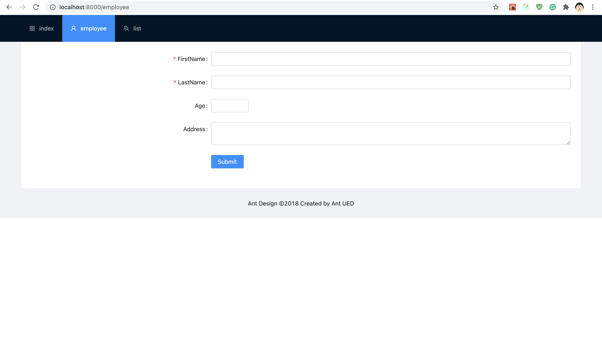
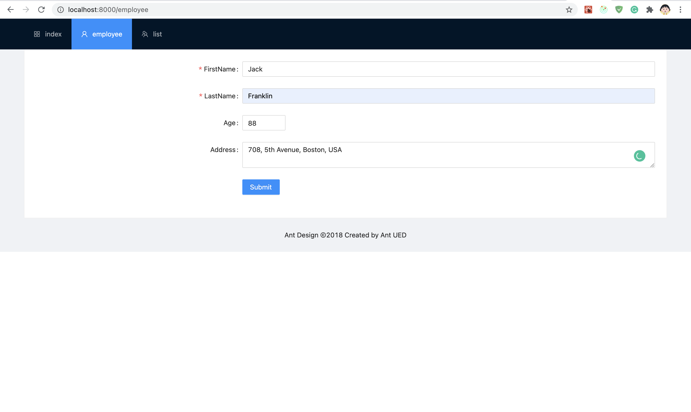
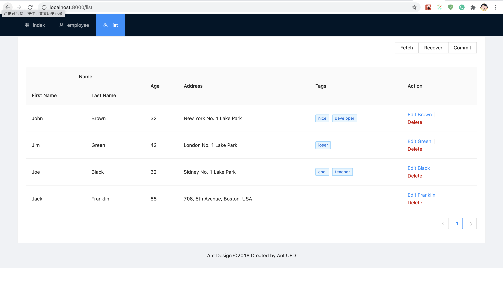

# 简单Web应用开发Assignment
author: wangguochang

## DDL与提交方式
请在2021年6月13日24点前完成本次Assignment，我们会依照各位的Git仓库中2021年6月13日最晚的commit版本为准进行检查。

请各位以**团队为单位创建仓库**，并向该仓库集中提交自己的commit。

请各位在[本仓库](https://github.com/nemoworks/SE2020Assignment)中提出issue，title格式为
**'WebDevAssignment-团队名'**，issue内容为各位的git仓库链接和**团队成员的学号，姓名，github账号**。

格式如[样例issue](https://github.com/nemoworks/SE2020Assignment/issues/3)。

请注意：
- issue内容用于我们检索各位的作业所在链接，因此建议各位在创建仓库后就创建自己的issue，避免遗忘。
- 个人成绩将依据团队各个成员对项目的**Contribution**和**团队作业**完成情况评定。
- Contribution以github项目的**insights/Contributors**页面为准，请务必**用自己的账号及时提交commits**。
- 团队作业完成情况由最终系统功能点实现情况而定。
- 在issue中请给出**github**项目地址，这会便于我们统计各位的Contribution。各团队可以在过程中自由选择git代码托管平台，如gitee，但最终提交时请勿忘记将gitee中的代码提交到**github项目**，例如你可以将gitee的代码pull到本地后进行以下操作:
```bash
git remote add webdev https://github.com/abcd/efgh.git #添加github仓库地址，并命名为webdev

push webdev master #将本地的代码推送到webdev的master分支
```

## 前言

本次Assignment模拟迭代开发一个小而功能完善的前端应用，共20个功能点。在检查功能点时只需检查最终实现即可。例如：当你完成了6.6，并且功能正确，即可认为在此之前的功能点都已正确完成。

请结合所学，尽力完成本次Assignment中的各个题目，并**不是**在**折磨**各位。我们不建议本领高强的码农们快速完成了此次作业后将代码share出去，如果对方是你的好兄弟/好姐妹或是男/女朋友，我们非常鼓励你负起责任**教会**ta❤️。

## 免责声明
人非圣贤，时间仓促，本文档可能存在缺字/漏字/语法错误/代码错误等。

如果你怀疑什么地方写错了或是感到某处表达不够清晰，**不要怀疑，都是我的错**🧎‍♂️。

请把对应位置截图标出并发到邮箱：dz1933026@smail.nju.edu.cn，作者会尽快进行勘误。

由于勘误随缘，无法预测，建议各位clone文档仓库后勤加git pull进行确认。

本次实验对于前端初学者来说难度极大且极为复杂，再次强调，**请尽力而为**，折磨各位**并无好处**，实验目的是为了让各位快速熟悉前端技术，仅此而已。

健康第一，请保持健康的身体，佛系的态度对待此次作业，多么琐碎的技术问题都可以提问助教，请不要独自烦恼，QQ群私聊 韩姓/王姓 助教均可。

## 提示
Web开发中需要善用搜索引擎，我们提供了一些参考网站，如:
- https://reactjs.org/
- https://developer.mozilla.org/zh-CN/
- https://ant.design/index-cn
- https://umijs.org/guide/
## 1. 项目创建(10')(累计: 10')
使用脚手架创建一个React项目，并成功运行，展示index界面。

提示：你可以使用umi或create-react-app，不要忘记安装依赖。

效果参考:


## 2. 路由(20')
### 2.1 路由配置(10')(累计: 20')
现在你已经有了一个项目，请在项目中添加路由，并提供至少两个页面，employee和list。

效果参考：输入不同的url，可以切换到不同的页面即可。

### 2.2 页面切换(10')(累计: 30')
为你的页面提供切换功能，即在你的页面中添加页面跳转的按钮/菜单/导航栏，使得页面切换可以在页面中完成。

效果参考：



## 3. 组件(10')(累计: 40')
在你的list页面中实现一个表格组件，表格需要展示如下信息，并在每行最后提供两个操作按钮 edit与delete：
```JSON
[
  {
    "key": "1",
    "firstName":  "John",
    "lastName":  "Brown",
    "age":  32,
    "address":  "New York No. 1 Lake Park",
    "tags":  ["nice", "developer"],
  },
  {
    "key": "2",
    "firstName":  "Jim",
    "lastName":  "Green",
    "age":  42,
    "address":  "London No. 1 Lake Park",
    "tags":  ["loser"],
  },
  {
    "key": "3",
    "firstName":  "Joe",
    "lastName":  "Black",
    "age":  32,
    "address":  "Sidney No. 1 Lake Park",
    "tags":  ["cool", "teacher"],
  }
]
```

提示：你可以直接引入ant desing的Table组件，事实上以上数据就来自于ant design table的[官方例子](https://ant.design/components/table-cn/)，并在此基础上稍作修改。

效果参考：


## 4. state(10')(累计: 50')
如果你直接引入了antd的table，那么此时数据是静态的，即使点击了delete，数据也不会被删除。请将上述data转移到组件的state中，并添加delete功能，使得delete被点击时，该条数据被删除。

提示：请仔细回忆如何在组件中初始化一个state，以及setState方法如何使用？

效果参考：点击delete后该条数据被删除即可。

## 5. 页面间数据共享(30')

### 5.2 从state到store-1(10')(累计: 60')
我们的学习过程中提到state管理的是组件内部的状态，如果想要employee和list页面共享一份数据，我们需要使用的是一个共享的数据store，请把之前保存在state内的数据改写到store内，并使用store内的数据初始化list页面中的表格。

提示：你可以使用redux或dva，如果你遗忘了如何使用，可以参考官方文档或善用搜索引擎。

效果参考：同第3题。

### 5.3 从state到store-2(10')(累计: 70')
在4中，我们通过state实现了delete功能，现在请将其改为通过store实现。

效果参考：同第4题。

### 5.4 从state到store-3(10')(累计: 80')
现在，你可以将employee页面与list页面相连接了，你需要在employee页面中打印出store内的数据。

效果参考：在employee中能打印出
```JSON
[
  {
    "key": "1",
    "firstName":  "John",
    "lastName":  "Brown",
    "age":  32,
    "address":  "New York No. 1 Lake Park",
    "tags":  ["nice", "developer"],
  },
  {
    "key": "2",
    "firstName":  "Jim",
    "lastName":  "Green",
    "age":  42,
    "address":  "London No. 1 Lake Park",
    "tags":  ["loser"],
  },
  {
    "key": "3",
    "firstName":  "Joe",
    "lastName":  "Black",
    "age":  32,
    "address":  "Sidney No. 1 Lake Park",
    "tags":  ["cool", "teacher"],
  },
]
```
在list中删除一条数据（如第一条）后，跳转回employee页面，打印出删除后的数据。
```JSON
[{
    "key": "2",
    "firstName":  "Jim",
    "lastName":  "Green",
    "age":  42,
    "address":  "London No. 1 Lake Park",
    "tags":  ["loser"],
  },
  {
    "key": "3",
    "firstName":  "Joe",
    "lastName":  "Black",
    "age":  32,
    "address":  "Sidney No. 1 Lake Park",
    "tags":  ["cool", "teacher"],
  },
]
```


## 6 综合题(60')
### 6.1 employee详情页面(10')(累计: 90')
请在employee页面中添加表单组件，形成employee的编辑页面，你需要提供FirstName，LastName，Age，Address的编辑组件，并提供一个Submit按钮用于提交数据。

提示1：本次测验全过程不会使用复杂的表单功能，因此你可以使用自己实现的简易表单组件，或是不使用表单组件，简单地插入4个input组件，和一个按钮，并分别进行管理。

提示2： 你也可以使用ant design的[Form组件](https://ant.design/components/form/)，事实上这是antd组件库的重要部分，也是实际开发中更常用的选项。如果你选用ant design的Form组件，由于ant design的1-4四个大版本中Form的API都有大幅不同，请务必确保你使用的ant design版本与你查看的ant design/form文档**版本一致**。你可以查看package.json来确认自己的ant design版本号。

效果参考：


### 6.2 路由-2(10')(累计: 100')
在第二题中，我们实现了list和employee的跳转。在第5题中，我们在employee页面打印了整个数组。

真正的详情页需要单独展示一条数据，请在list页面中的edit按钮上实现新的路由跳转，使得点击某条数据的edit页面后，能够跳转到该条数据对应的详情页。

提示：你可以使用在employee页面的路由中添加**query参数**或**约定式路由**或来区分不同的数据，例如对于Joe，你可以跳转到"\/employee?key=3"或"/employee/3"。

### 6.3 路由-3(10')(累计: 110')
如果你完成了5.4，想必你已经可以在employee页面中获取到所有的store中的数据。在6.2中，我们已经可以从路由区分当前的详情页属于哪一条数据。

请依据路由中的信息，将5.4中在employee打印的所有数据改为打印与路由信息标识的那一条数据。

提示：还记得第2题吗，之前我们通过第2题的按钮跳转到"/employee"，这时employee可能并不是从6.2的edit跳转而来，因此没有query参数，或是约定式子路由。实际开发中如果不处理这种情况，很可能导致bug。因此在读取路由信息时，别忘了处理不带query参数或是约定式子路由的情况，例如你可以在此时打印完整的store数据。

效果参考：例如当前路由为"\/employee?key=3"，则打印
```JSON
  {
    "key": "3",
    "firstName":  "Joe",
    "lastName":  "Black",
    "age":  32,
    "address":  "Sidney No. 1 Lake Park",
    "tags":  ["cool", "teacher"],
  }
```

### 6.4 employee详情页面2(10')(累计: 120')
我们已经从6.3得到了当前页面的数据，从6.1得到了这些数据对应的编辑组件。

请使用6.3的数据初始化6.2的组件。

提示1：请参考该组件对应的文档来实现初始化。

提示2：和6.3一样，别忘了处理不带query参数或是约定式子路由的情况，例如你可以在此时，不对组件进行初始化。

效果参考：在组件中显示对应的值即可。

### 6.5 employee详情页面3(10')(累计: 130')
是时候让Submit按钮发挥作用了。

请实现Submit功能，使用employee页面组件编辑数据，并在list页面正常显示。

效果参考：例如在employee页面中将Joe的age改为99，跳转到list查看，对应数据变为99。

### 6.6 employee详情页面4(10')(累计: 140')
6.3中的提示已经指出，employee页面除了"/employee?key=1"，"/employee?key=2"，"/employee?key=3"以外，还有个"/employee"页面，让我们为这个页面分配一个功能。

当employee页面没有query参数或是约定式子路由时，可以通过Submit将表单内容push到store中的数组。

提示1: 6.1中employee页面上只有FirstName，LastName，Age，Address四个输入组件，而实际的data还有key和tags字段。

- tags：对于tags字段，我们不作要求，你可以在Submit时简单地添加一个tags字段并设置为空数组。
- key：如果你在6.3中是通过key来区分Joe，Jim和John，那么对于新的数据，你也需要为它分配一个key，例如你可以将key设置为当前store中的数组长度+1。否则该数据的edit功能会出现bug。

效果参考: 在"/employee"页面新增一条数据，Submit后在list页面查看成功即可。



## 7 模拟后台(50')
此部分内容并非前端开发核心。然而掌握附加题技能想必可以令各位成为**更高阶**的前端开发者，请各位善用搜索引擎和官方文档，攻克难关。
### 7.1 mock(10')(累计: 150')
在前端后台分离的开发中，有时后端大哥不可避免地API实现的很慢，这时我们就需要模拟(mock)出一套和后台一致的接口，从而使得我们避免等待，早写完早下班。

请把第3题中的数据复制，并保存到data.json。

请实现一个mock接口，"GET /api/data"，并返回data.json中的数据。

提示1：如果你不知道什么是GET，请善用搜索引擎，学习Restful接口知识。

提示2：如果你使用了umi框架，你可以查阅https://umijs.org/zh-CN/docs/mock。如果你没有使用umi，可以使用第三方的库，例如mockjs，并善用搜索引擎学习其使用，例如https://juejin.cn/post/6844904104750219271。

提示3：在react中引用data.json并不复杂，import data from "./data.json"(你需要改为data.json所在的路径)。

效果参考：如果前端项目运行于localhost:8000，只需在浏览器访问localhost:8000/api/data，查看是否打印正确即可。

### 7.2 mock-2: 简易持久化(20')(累计: 180')
请实现一个mock接口，"POST /api/data"。接收一个post请求，发起请求时需要附带一个body，接口收到body后将body数据写入data.json。

提示1：如果你不知道什么是POST，什么是body，请善用搜索引擎，学习POST请求格式。

提示2：如果你不知道如何获取body，可以查看以下umi示例，如果你使用的不是umi，请善用浏览器查阅相关文档。
```javascript
// mock/api.js
export default {
  "POST /api/users/create": (req, res) => {
    // 添加跨域请求头
    res.setHeader("Access-Control-Allow-Origin", "*');
    console.log(req.body);
    res.end("ok');
  },
}
```
提示3：如果你不知道如何写入文件，可以使用Nodejs自带的fs库（无需通过npm install来安装）：
```javascript
import fs from "fs"
```
并调用writeFileSync方法
```javascript
fs.writeFileSync(...)
```
关于writeFileSync方法的使用，请善用搜索引擎，查阅MDN等网站。

提示4：当写入文件时，通常不能直接写入一个JavaScript对象（如Object或Array），你需要将它转换为字符串，例如使用JSON.stringify()等库函数（无需安装，无需import）。如果你不清楚它的用法，请善用搜索引擎，查阅MDN等网站。

效果参考：你可以使用命令行工具如wget，或是带GUI的应用如postman来模拟一个post请求，如果你不清楚他们的使用，请善用搜索引擎。发起post请求，在body中写入一个object或array，发起请求后发现data.json内容变化即可。

### 7.3 mock-3: 模拟后台调用(20')(累计: 190')
我们已经实现了从静态文件(data.json)的数据获取和写入，最后一步我们需要将数据接入到store，模拟从前端请求数据->初始化store->在前端修改数据->将store中的数据发送到后台的完整流程。

你需要将store中原有的初始化数据改成空数组，并通过调用"GET /api/data"来初始化数据。

你需要实现一个Commit按钮，点击Commit按钮后调用"POST /api/data"数据将当前store数据写入data.json。

提示1：你可以使用umi-request，fetch等包向后台发起请求。

提示2：如果你不清楚如何结合fetch/umi-request与dva/redux，请参考dva或redux的相关文档和帖子，如https://github.com/dvajs/dva-docs/blob/master/v1/zh-cn/tutorial/07-%E6%B7%BB%E5%8A%A0Effects.md。

提示3：dva的官方文档写的并不详细，很可能无法解决你的问题，这种情况也不只限于dva，搜索一些相关的帖子和样例代码可以令你有所收获。

效果参考：在employee或list页面修改数据后查看data.json，发现数据出现对应改变即可。

## 8 简易后台(10')

在第7题中，mock实现的简易server行为与真实的后台是一致的。但在真实开发中，Spring框架是更为主流的后台解决方案，请用Spring框架替换7.1-7.3中的mock。

你需要实现两个接口

- "GET /api/data"

- "POST /api/data"

提示1：你需要修改之前umi-request/fetch的请求路径，包括ip和端口。

提示2：你可能会遇到跨域（CORS）问题，它可以在前端解决，也可以在后端解决，这是一个很常见的问题，你可以借助搜索引擎解决它。
>>>>>>> 61025d871ed0016b8875719903e19755539c1a4f
